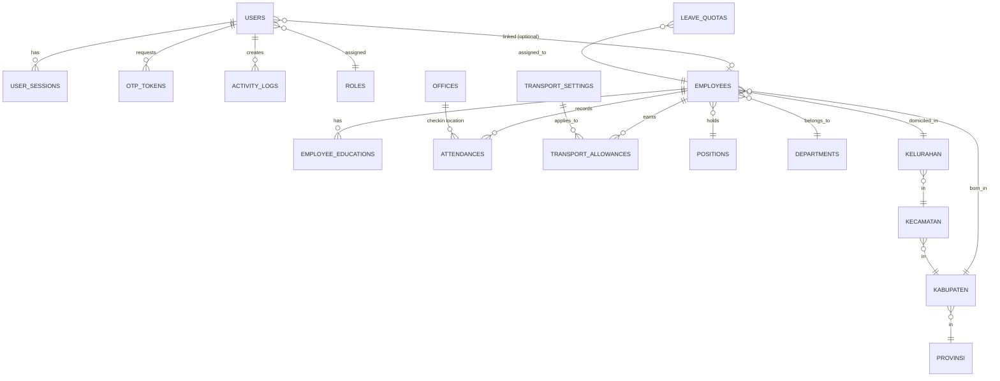

# ERD & Database Schema — Aplikasi HRD JMC

> Disusun mengacu CLAUDE.md (simplest viable, no speculative tables) dan kebutuhan modul di soal praktik.

## 1. Diagram Relasi (Mermaid)

## 2. Tabel & Kolom Utama

### 2.1 Authentication & Authorization

**`roles`** — master role
| col | type | note |
|---|---|---|
| id | PK | |
| name | varchar(50) unique | `superadmin`, `manager_hrd`, `admin_hrd` |
| description | text | |

**`users`** — akun login
| col | type | note |
|---|---|---|
| id | PK | |
| employee_id | FK → employees | nullable (superadmin tidak harus pegawai) |
| role_id | FK → roles | |
| username | varchar(50) unique | lowercase, alphanumeric, min 6 |
| password_hash | varchar(255) | bcrypt/argon2 |
| is_active | bool default true | |
| last_login_at | timestamp | |
| created_at, updated_at, deleted_at | timestamps | soft delete |

**`user_sessions`** — kontrol session + force-logout saat user di-nonaktifkan
| col | type | note |
|---|---|---|
| id | PK | |
| user_id | FK | |
| token_hash | varchar(255) unique | hash dari refresh/session token |
| remember_me | bool | tentukan TTL |
| ip_address, user_agent | varchar | audit |
| expires_at | timestamp | |
| revoked_at | timestamp nullable | set saat user di-nonaktifkan / logout |
| created_at | timestamp | |

**`otp_tokens`** — OTP 60 detik via email
| col | type | note |
|---|---|---|
| id | PK | |
| user_id | FK | |
| code_hash | varchar(255) | hash 6-digit OTP |
| purpose | varchar(20) | `login`, `reset_password` |
| expires_at | timestamp | now + 60s |
| consumed_at | timestamp nullable | |
| attempts | int default 0 | rate limit |
| created_at | timestamp | |

### 2.2 Master Wilayah Indonesia (4 level)

**`provinsi`** — id (PK, code BPS), name
**`kabupaten`** — id, name, provinsi_id (FK)
**`kecamatan`** — id, name, kabupaten_id (FK)
**`kelurahan`** — id, name, kecamatan_id (FK)

> Seed dari dataset wilayah (mis. https://github.com/emsifa/api-wilayah-indonesia). Index pada `name` untuk autosuggest.

### 2.3 Master Pegawai

**`positions`** (jabatan) — id, name (`Manager`, `Staf`, `Magang`, `Karyawan`)
**`departments`** — id, name (`Marketing`, `HRD`, `Production`, `Executive`, `Commissioner`)
**`offices`** (gedung kantor) — id, name (`Gedung Utama`, `Gedung A`, `Gedung B`), latitude, longitude

**`employees`**
| col | type | note |
|---|---|---|
| id | PK | |
| nip | varchar(20) unique | min 8 digit, angka only |
| full_name | varchar(150) | |
| email | varchar(150) unique | |
| phone | varchar(20) | format internasional `+62...` |
| photo_path | varchar(255) | path file PNG/JPEG/JPG |
| address_kelurahan_id | FK → kelurahan | provinsi/kabupaten/kecamatan dapat di-derive |
| address_detail | text | |
| latitude | decimal(10,7) | |
| longitude | decimal(10,7) | |
| birth_kabupaten_id | FK → kabupaten | tempat lahir |
| birth_date | date | |
| marital_status | enum | `kawin`, `tidak_kawin` |
| children_count | smallint | 0–99 |
| join_date | date | tanggal masuk |
| age | int generated/computed | derived dari birth_date *(catatan: soal sebut "dari tanggal masuk" — ada bug; saya catat asumsi pakai birth_date)* |
| position_id | FK | |
| department_id | FK | |
| employment_type | enum | `kontrak`, `tetap`, `magang` |
| gender | enum | `pria`, `wanita` (untuk doughnut chart dashboard) |
| is_active | bool default true | |
| created_at, updated_at, deleted_at | timestamps | |

**`employee_educations`** — form dinamis pendidikan
| col | type | note |
|---|---|---|
| id | PK | |
| employee_id | FK | |
| level | varchar(50) | `SD`, `SMP`, `SMA`, `D3`, `S1`, dll |
| institution | varchar(150) | |
| major | varchar(100) | nullable |
| year_start, year_end | smallint | |
| sort_order | smallint | drag-and-drop ordering |

### 2.4 Tunjangan Transport

**`transport_settings`** — base fare per km, tarif global aktif
| col | type | note |
|---|---|---|
| id | PK | |
| base_fare_per_km | decimal(12,2) | rupiah |
| effective_from | date | versioning, supaya histori tarif tetap akurat |
| created_by | FK users | |
| created_at | timestamp | |

**`transport_allowances`** — hasil hitung per pegawai per bulan
| col | type | note |
|---|---|---|
| id | PK | |
| employee_id | FK | |
| period_year, period_month | smallint | |
| distance_km_raw | decimal(6,2) | jarak rumah-kantor (haversine dari lat/long) |
| distance_km_used | smallint | hasil pembulatan + clamp 5–25 km |
| working_days | smallint | hari masuk efektif |
| base_fare | decimal(12,2) | snapshot tarif yang berlaku |
| amount | decimal(14,2) | hasil = base_fare × km_used × working_days |
| eligible | bool | false jika <19 hari atau bukan tetap |
| reason | varchar(200) | "Hari masuk <19", "Bukan pegawai tetap", dll |
| computed_at | timestamp | |

> Unique index `(employee_id, period_year, period_month)`.

### 2.5 Presensi & Cuti

**`leave_quotas`** — kuota cuti/izin/unpaid leave per pegawai per tahun
| col | type | note |
|---|---|---|
| id | PK | |
| employee_id | FK | |
| year | smallint | |
| cuti_quota, izin_quota, unpaid_leave_quota | decimal(4,1) | menampung 1 desimal |
| created_at, updated_at | timestamps | |

**`attendances`** — record harian per pegawai
| col | type | note |
|---|---|---|
| id | PK | |
| employee_id | FK | |
| date | date | unique dengan employee_id |
| office_id | FK → offices | nullable kalau cuti/izin |
| check_in_at | timestamp | |
| check_out_at | timestamp | |
| check_in_office_id | FK | |
| check_out_office_id | FK | |
| status_kehadiran | enum | `hadir`, `cuti`, `izin`, `unpaid_leave` |
| duration_hours | decimal(4,1) | |
| status | enum | `terpenuhi`, `tidak_terpenuhi` |
| late_minutes | int | |
| is_halfday | bool | |
| verifikasi | enum | `disetujui`, `ditolak`, `pending` |
| verifikator | enum | `lead`, `manager`, `hrd` |
| verifikator_user_id | FK users | nullable |
| keterangan | text | |
| source | enum | `import_excel`, `manual` |
| created_at, updated_at | timestamps | |

> Unique `(employee_id, date)` untuk cegah double entry.
> Index `(employee_id, date)` untuk query rekap bulanan.

**`attendance_imports`** — track background job import Excel
| col | type | note |
|---|---|---|
| id | PK | |
| user_id | FK | yang upload |
| file_path | varchar | |
| period_year, period_month | smallint | |
| status | enum | `queued`, `processing`, `done`, `failed` |
| total_rows, success_rows, failed_rows | int | |
| error_log | jsonb / text | |
| created_at, finished_at | timestamps | |

### 2.6 Audit Log

**`activity_logs`**
| col | type | note |
|---|---|---|
| id | PK | |
| user_id | FK nullable | nullable untuk failed login attempt |
| username | varchar | snapshot |
| action | varchar(50) | `login`, `logout`, `create`, `read`, `update`, `delete` |
| module | varchar(50) | `Login`, `Pegawai`, `Presensi`, `Tunjangan`, `User`, dll |
| description | varchar(255) | |
| target_type, target_id | varchar | optional, untuk traceability |
| ip_address, user_agent | varchar | |
| created_at | timestamp | indexed |

## 3. Catatan Asumsi (akan dipindah ke ASUMSI.md)

1. **Usia di-derive dari `birth_date`**, bukan `join_date` (soal terlihat typo).
2. **Pembulatan km saat desimal > 0.5** → ke atas (soal hanya menyebut <0.5 dan =0.5; mengikuti aturan matematis standar).
3. **Jarak rumah-kantor** dihitung dengan haversine antara `employees.latitude/longitude` dan `offices.latitude/longitude` (kantor mana? → asumsi: gedung utama, atau yang terdekat).
4. **`Pegawai tetap`** = `employment_type = 'tetap'`.
5. **Gender** ditambahkan (tidak disebut soal) karena dashboard meminta doughnut chart pria vs wanita.
6. **Kuota cuti/izin/unpaid leave** dipisah ke tabel `leave_quotas` per tahun supaya bisa di-reset tiap tahun.
7. **Soft delete** pakai `deleted_at` di tabel utama (users, employees) supaya bisa audit & restore.
8. **OTP & token disimpan sebagai hash**, bukan plaintext — security baseline.

## 4. Stack Implementasi yang Disarankan

- **Prisma ORM** + **PostgreSQL** — relasi & migration jelas, mendukung jsonb, generated column, dan transactions.
- **BullMQ + Redis** — queue untuk import Excel (modul Presensi).
- **Sequelize/Knex** sebagai alternatif kalau lebih familiar.

Skema Prisma siap saya generate di file terpisah (`prisma/schema.prisma`) saat scaffold project.
